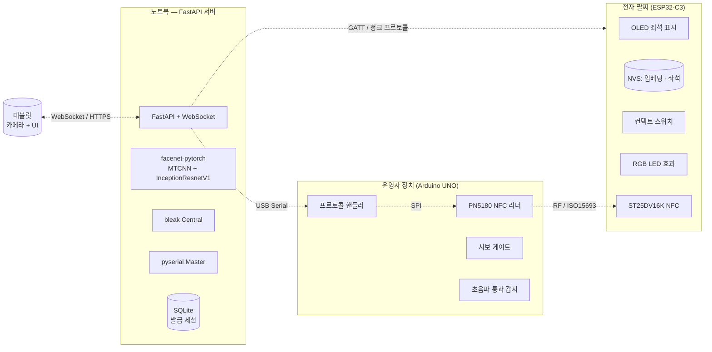

# inha-face-ticket

오프라인 얼굴인증 전자 티켓 시스템 — 인하대학교 IoT 프로그래밍(ITC3211) 기말 프로젝트.


운영자 페이지(좌)와 태블릿 얼굴 인식 페이지(우)가 동시 동작하는 모습. 우측 카메라 프레임 아래에 추출된 512-d 얼굴 임베딩이 막대 그래프로 시각화되어 있다.

## 개요

공연·행사장에서 종이 티켓을 대체하는 전자 팔찌 기반 입장 시스템을 만들었다. 핵심은 사용자의 얼굴 임베딩 벡터를 클라우드가 아닌 팔찌(ESP32-C3) 내부 메모리에 저장하는 것이다. 입장 게이트는 팔찌에서 BLE 로 벡터를 받고, 현장 카메라로 새 벡터를 추출해 코사인 유사도만으로 본인 여부를 판정한다. 외부 서버나 행사장 네트워크가 없어도 입장 절차가 동작한다.

팔찌가 손목에서 한 번이라도 분리되면 컨택트 스위치가 그 사실을 영구 플래그로 기록하고, 입장 시 게이트가 이 플래그를 함께 read 해 유사도와 무관하게 거부한다. 카드 양도 형태의 위변조를 물리적으로 막기 위한 장치다.

## 시스템 구성



서버는 `domain/` ← `application/` ← `adapters/` 의 3-레이어 헥사고날 구조로, 안쪽 계층은 바깥 계층을 모른다. 도메인은 numpy 외 import 가 없고, BLE / 얼굴 인식 / 시리얼 어댑터는 의존성이 없거나 mock 강제 시 자동으로 mock 으로 폴백한다. 덕분에 펌웨어가 도착하기 전에도 발급·입장·반납 상태 기계를 노트북 단독으로 검증할 수 있었다.

## 문서

| 문서 | 내용 |
|---|---|
| [docs/architecture.md](docs/architecture.md) | 계층 의존성 규칙, 포트 인터페이스, IssueFlow 데이터 흐름 |
| [docs/iot-design.md](docs/iot-design.md) | 엣지 인증, 전력 관리, 멀티 프로토콜, 위변조 방어 등 IoT 관점 설계 결정 |
| [docs/flows.md](docs/flows.md) | 발급 / 입장 / 반납 세 플로우의 단계별 시퀀스 + 상태 기계 |
| [docs/hardware.md](docs/hardware.md) | Bill of Materials, 전원 경로, 로직 레벨, I²C 주소 맵, 전력 예산 |
| [docs/ble-protocol.md](docs/ble-protocol.md) | GATT characteristics, 2KB → 256B 청크 프로토콜, LED 효과 코드 |
| [docs/serial-protocol.md](docs/serial-protocol.md) | 노트북 ↔ Arduino USB Serial 명령/응답 |
| [docs/ws-protocol.md](docs/ws-protocol.md) | WebSocket 메시지 스키마 |
| [server/README.md](server/README.md) | 백엔드 상세 + 실행 가이드 (환경변수 · HTTPS · 트러블슈팅) |

## 실행

```bash
cd server
python -m venv .venv && source .venv/bin/activate    # Windows: .venv\Scripts\Activate.ps1
pip install -r requirements.txt
python run.py
```

또는 헬퍼: `./scripts/run-dev.sh` (Linux/macOS) · `.\scripts\run-dev.ps1` (Windows).

- 운영자: <https://localhost:8000/admin>
- 태블릿: `https://<노트북IP>:8000/tablet` (카메라 권한은 HTTPS 위에서만 허용되므로 자체 서명 인증서가 부팅 시 자동 생성된다)

환경변수와 트러블슈팅은 [server/README.md](server/README.md#실행), 펌웨어 빌드는 [docs/hardware.md](docs/hardware.md#펌웨어-빌드) 참고.

## 진행 상황

- [x] W10 — 주제 확정, 부품 1차 선정, 팀 계약
- [x] W11 — 시스템 설계 (BLE/NFC/Serial 채널), 부품 호환성 검토, 발주
- [x] W12 — 소프트웨어 아키텍처 (헥사고날), 발급 흐름 1차 프로토타입 동작
- [ ] W13 — ESP32-C3 BLE Peripheral GATT, PN5180 SPI 구현, 입장 흐름 통합
- [ ] W14 — 코사인 유사도 임곗값 캘리브레이션, 정면도 게이트 데이터 수집
- [ ] W15 — 최종 시스템 통합 + 데모 시나리오 리허설
- [ ] 최종 — 보고서 / 발표 / 시연

## 팀

| 이름 | 역할 |
|---|---|
| 박하제 | AI · 얼굴 인증 알고리즘 — facenet-pytorch 파이프라인, 정면도 게이트, 코사인 유사도 판정 로직 |
| 조승준 | 하드웨어 · 무선 통신 — ESP32-C3 펌웨어, ST25DV16K I²C·GPO, BLE/NFC 프로토콜 |

## License

MIT (예정).

---

<sub>구현은 Claude Code 와 Claude Design 을 페어로 사용했습니다.</sub>
